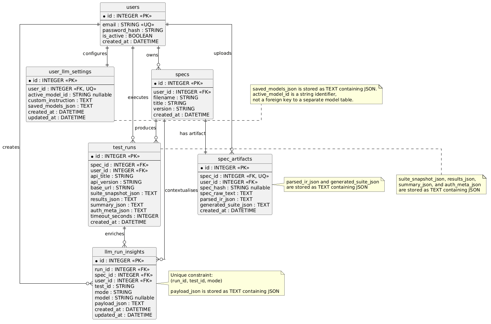

# ContractGuard Technical Guide

## Title Page

| Field | Value |
| --- | --- |
| Project title | ContractGuard |
| Student1 name | Chunyang Wang |
| Student1 ID | 21115214 |
| Student2 name | Justin Siak |
| Student2 ID | 22449184 |
| Supervisor | Graham Healy |
| Date of completion | 30/04/2026 |


## Abstract

ContractGuard is an automated API contract testing platform designed to turn OpenAPI and Swagger specifications into inspectable, editable, and executable test suites. The system parses API documents, extracts a structured intermediate representation, generates deterministic rule-based JSON test cases, displays those cases in a React frontend for review and editing, executes them through a FastAPI backend test runner against live APIs, stores the resulting run data, and uses an LLM to provide human-readable explanations for test failures. The platform also includes support for additional test case generation and a chat interface, allowing users to explore failures, behaviours, and possible improvements more easily.

ContractGuard is integrated with GitHub Actions so that the testing pipeline can run automatically on pull requests or when specification folders in the main branch are updated. This makes the platform suitable for continuous contract verification in a real development workflow. Runtime mapping and secure secret ingestion allow tests to run against real-world APIs without hardcoding credentials or repeatedly modifying generated test cases. The implementation uses Python, FastAPI, SQLAlchemy, React, Vite, PostgreSQL, Docker Compose, runtime mapping, and GitHub Actions to keep the pipeline reproducible and consistent across local development and CI environments.


## Table of Contents

| Section | Content |
| --- | --- |
| Abstract | Project summary |
| 1. Introduction | Overview of the project, why it exists, and the core terminology used throughout the guide |
| &nbsp;&nbsp;1.1 Project Overview | End-to-end workflow, artifact flow, and execution model |
| &nbsp;&nbsp;1.2 Project Motivation | Why the project was built and what gap it fills |
| &nbsp;&nbsp;1.3 Project Glossary | Core terms used across the guide |
| 2. Research | Background research on the specification, testing approach, supporting stack, and the trade-offs that shaped the implementation |
| &nbsp;&nbsp;2.1 OpenAPI Specification | Specification structure, parsing format, and why it is the project’s source of truth |
| &nbsp;&nbsp;2.2 API Contract Testing | Contract verification goals and how live API results are compared with the spec |
| &nbsp;&nbsp;2.3 Existing Tools and Comparison | Schemathesis, Postman, Newman, and the design trade-offs behind each option |
| &nbsp;&nbsp;2.4 Rule Based Test Generation | Deterministic generation, traceability, and the role of generator rules |
| &nbsp;&nbsp;2.5 Backend Framework | FastAPI and Python backend reasoning |
| &nbsp;&nbsp;2.6 Frontend Framework | React and Vite UI choice |
| &nbsp;&nbsp;2.7 Database / Storage | PostgreSQL persistence and relational model |
| &nbsp;&nbsp;2.8 LLM Integration | Explanation-only LLM usage |
| &nbsp;&nbsp;2.9 Docker and CI/CD | Containerization and automation setup |
| 3. System Design | Architectural choices, pipeline structure, runtime mapping, and the responsibilities of each major component |
| &nbsp;&nbsp;3.1 Design Principles | Deterministic generation, separation of concerns, and inspectable outputs |
| &nbsp;&nbsp;3.2 System Architecture | Component-level architecture and boundaries |
| &nbsp;&nbsp;3.3 Data Flow / Pipeline Design | Spec-to-result pipeline, runtime mapping stage, and result handoff |
| &nbsp;&nbsp;3.4 Intermediate Representation Design | IR fields and normalization strategy |
| &nbsp;&nbsp;3.5 Test Case Data Model | Shared JSON model between frontend and runner |
| &nbsp;&nbsp;3.6 Frontend Design | Review/edit workflow and client-side state |
| &nbsp;&nbsp;3.7 Backend Design | Orchestration, persistence, and API responsibilities |
| &nbsp;&nbsp;3.8 Test Runner Design | HTTP execution and verdict logic |
| &nbsp;&nbsp;3.9 LLM Explanation Design | Evidence-driven explanation flow |
| 4. Implementation | Concrete implementation details for each subsystem, including runtime mapping and GitHub Actions integration |
| &nbsp;&nbsp;4.1 Project Management and Repository Structure | Monorepo layout and folder responsibilities |
| &nbsp;&nbsp;4.2 Development Environment | Backend, frontend, database, and CI toolchain |
| &nbsp;&nbsp;4.3 OpenAPI Parser and IR Extractor | Spec loading, ref resolution, and normalization |
| &nbsp;&nbsp;4.4 Test Case Generator | Rule modules, sample data, and auth coverage |
| &nbsp;&nbsp;4.5 Test Runner | Suite execution and skip logic |
| &nbsp;&nbsp;4.6 Frontend Implementation | UI orchestration and client persistence |
| &nbsp;&nbsp;4.7 Database / Persistence Implementation | Data models and stored artifacts |
| &nbsp;&nbsp;4.8 LLM Integration Implementation | Prompt bundling and fallback handling |
| &nbsp;&nbsp;4.9 Docker and CI/CD Implementation | Multi-service runtime and workflow orchestration |
| &nbsp;&nbsp;4.10 Runtime Mapping Integration | Placeholder replacement and mapping precedence |
| &nbsp;&nbsp;4.11 GitHub Actions Integration | Reusable workflow and caller workflow |
| 5. Sample Code | Representative code excerpts from the parser, generator, runner, LLM, and CI pipeline |
| &nbsp;&nbsp;5.1 IR Extraction Function | Parser-to-IR example |
| &nbsp;&nbsp;5.2 Test Case Generation Rule | Rule-based auth-negative example |
| &nbsp;&nbsp;5.3 Sample Data and Guardrails | Deterministic semantic values and safety caps |
| &nbsp;&nbsp;5.4 Test Runner Execution Function | HTTP request execution example |
| &nbsp;&nbsp;5.5 Response Validation Logic | Status code comparison example |
| &nbsp;&nbsp;5.6 LLM Explanation Prompt/Function | Evidence-to-prompt example |
| &nbsp;&nbsp;5.7 CI/CD Workflow Snippet | Reusable workflow example |
| 6. Problems and Resolutions | Implementation problems, causes, fixes, and what each fix changed in the pipeline |
| &nbsp;&nbsp;6.1 Handling Different OpenAPI Specification Structures | Normalizing inconsistent spec layouts |
| &nbsp;&nbsp;6.2 Resolving $ref Schemas | Recursive reference resolution |
| &nbsp;&nbsp;6.3 Generating Realistic Test Data | Semantic values and boundary caps |
| &nbsp;&nbsp;6.4 Avoiding Invalid Optional Auth/Header Injection | Header filtering and auth-safe generation |
| &nbsp;&nbsp;6.5 Real API Behaviour Not Matching the Specification | PASS/FAIL/SKIP reporting against live APIs |
| &nbsp;&nbsp;6.6 Authentication and Sandbox APIs | Runtime mapping and secret-based execution |
| &nbsp;&nbsp;6.7 Docker/Environment Issues | Multi-service startup and environment isolation |
| &nbsp;&nbsp;6.8 LLM Reliability | Keeping the model outside verdict logic |
| 7. Results | Functional outcome, evaluation summary, and evidence |
| &nbsp;&nbsp;7.1 Functional Results | End-to-end workflow outcome |
| &nbsp;&nbsp;7.2 Evidence | Screenshots of UI, LLM explanation, and CI results |
| &nbsp;&nbsp;7.3 Quality Evaluation | Determinism, inspectability, and runtime behaviour |
| 8. Future Work | Coverage, auth, validation, UI, and CI improvements |
| 9. References | Core documentation and real-world API references |
| 10. Conclusion | Summary of the project’s design and implementation |

## 1. Introduction

### 1.1 Project Overview

ContractGuard is a pipeline based API contract testing platform that turns OpenAPI and Swagger specifications into generated, reviewable, and executable test suites. The system uses the API specification as the source of truth and processes it through a sequence of clear stages: specification parsing, intermediate representation extraction, deterministic test case generation, frontend review and editing, backend test execution, result storage, and optional LLM  failure explanation and suggest extra test cases.

A key design goal of ContractGuard is transparency. Each stage produces an inspectable artifact, so users can see how the original API specification is interpreted, what test cases are generated, how those cases are executed, and why particular tests pass or fail. This makes the platform useful not only as a test runner, but also as a complete workflow for debugging, reviewing, and demonstrating API contract testing.

ContractGuard also supports GitHub Actions integration, allowing generated test suites to be run automatically in a CI workflow. For example, the pipeline can be triggered when a pull request is opened or when API specification folder are updated on the main branch. This extends the platform beyond local testing and makes it suitable for continuous contract verification in a real development environment. Runtime mapping and secret ingestion allow the same generated cases to be reused across local and CI runs without hardcoding credentials or repeatedly editing the test data.


### 1.2 Project Motivation

We built this project because manual API testing is repetitive and difficult to maintain when an API changes often. OpenAPI specifications already contain a large amount of useful testing information, but in many workflows that information is read by developers and then recreated manually in tests. That process is slow, prone to inconsistency, and hard to audit later.

Our motivation for ContractGuard was to make generated tests visible, repeatable, and editable. Save time for developers who would otherwise have to manually create and maintain these tests. Existing tools can be powerful, but many of them focus on execution or fuzzing rather than on producing stable JSON test artifacts that a person can review, store, and rerun. We wanted a system where the generated output is not opaque. A reviewer should be able to see why a test exists, what input it uses, and what result it expects, then adjust the suite if the API changes or if a specific case needs to be demonstrated more clearly. Also if any behaviour is unexpected during execution between api specs and real APIs.
### 1.3 Project Glossary

| Term | Meaning in this project |
| --- | --- |
| OpenAPI | The machine readable specification format used as the source of API contract information. |
| API contract testing | Checking whether a live API behaves according to its documented contract, especially for status codes, schemas, and required inputs. |
| Intermediate Representation (IR) | The normalized internal data structure extracted from API specifications and used by the generator and runner. |
| Test case generator | The deterministic rule based component that turns IR data into JSON test cases. |
| Test runner | The component that converts test cases into HTTP requests and evaluates the responses. |
| Happy path test | A valid request that should succeed under normal conditions. |
| Negative test | A request that intentionally violates schema or contract expectations. |
| Boundary test | A test that uses minimum, maximum, empty, or near-limit values. |
| Authentication test | A test that checks the API behaviour when credentials are missing, invalid, or empty. |
| LLM explanation | A post processing step that explains a failure in readable language after the runner has already decided the result. |
| CI/CD | Continuous integration and continuous delivery/deployment automation used to run the pipeline consistently. |
| Docker | Container technology used to package the backend, frontend, and database in a reproducible local environment. |

## 2. Research

### 2.1 OpenAPI Specification

We chose OpenAPI 3.0 as the primary input format because it is already designed to describe HTTP APIs in a structured and machine readable way. The specification contains the endpoint paths, methods, parameters, request bodies, response schemas, and security schemes that a contract testing tool needs. That makes OpenAPI a natural source of truth for a system that is supposed to generate tests automatically rather than rely on handwritten test metadata.

In this project, the parser accepts OpenAPI documents in JSON or YAML form and normalizes them into a single internal model. That is useful because the source documents can vary in format even when they describe the same API. OpenAPI also fits the project goal of deterministic generation: if the input contract is stable, the generated test suite can also remain stable and comparable across runs.

### 2.2 API Contract Testing

API contract testing checks whether the behaviour of a live API matches its published contract, usually defined by an API specification. In practice, this means verifying whether a request returns the expected status code, whether the response structure is consistent with the schema, and whether the API responds correctly to missing, invalid, or unexpected data. This differs from unit testing because the system is tested as a live HTTP service rather than as isolated code.

We used contract testing as the core problem definition because it fits well with the type of evidence provided by OpenAPI. The contract gives a structured description of the expected API behaviour, and the runner can compare those expectations with actual live responses. This makes the testing process easier to justify in a technical guide because each generated case can be traced back to the specification rather than to an arbitrary manual decision.

### 2.3 Existing Tools and Comparison

We compared the project conceptually with tools such as Schemathesis, Postman, and Newman. Schemathesis is strong when the goal is property based or fuzz style testing, where the tool explores many unexpected combinations of inputs. This approach is valuable for discovering edge cases, but it tends to prioritise broad exploration rather than producing a stable, inspectable suite of test cases. Postman and Newman are useful for creating and running curated API test collections, but they are not primarily focused on generating a deterministic suite from an OpenAPI specification and turning that suite into editable JSON artifacts.

ContractGuard was designed with a different emphasis. The goal was to make the generated output deterministic, readable, and easy to store as a project artifact. This means the generated test cases are not only executable, but also reviewable, editable, and reproducible. This is the main design difference that justified building a custom pipeline instead of relying entirely on existing execution or fuzzing tools.

### 2.4 Rule Based Test Generation

We used deterministic rule-based generation rather than LLM generated tests because we needed repeatability and traceability. A rule-based generator can explain why a case exists: a missing required field triggers a negative test, an enum or constraint triggers a boundary test, and security requirements trigger an authentication test. That makes the output predictable and easier to validate against the source contract.

LLM-generated tests can be useful for brainstorming, but they are not ideal as the main generator for a system like this. They are harder to reproduce, they can drift between runs, and they are difficult to validate in a technical guide unless the prompt and model behaviour are tightly controlled. In this project we kept the LLM in a secondary role so that the core test suite remains deterministic while the model only helps explain or summarise the results and also given extra test cases suggestions based on the evidence of the execution results.

### 2.5 Backend Framework

We used Python and FastAPI because the backend had to coordinate several Python heavy tasks: parsing OpenAPI, generating tests, running HTTP requests, storing results, and handling LLM integration. Keeping those tasks in the same language reduced glue code and made it easier to share data models and helper functions across the parser, generator, runner, and API layer. The backend dependencies in the repository include FastAPI 0.115.12, SQLAlchemy 2.0.41, psycopg 3.2.9, PyYAML 6.0.2, requests 2.32.3, and uvicorn for serving.

FastAPI was also a suitable choice because it supports clean request and response modelling, which is useful for an API that exposes auth, spec handling, execution, run history, and LLM settings endpoints. The framework fits the project’s structure because it lets the backend act as an orchestration layer rather than as a thin script wrapper around the runner.

### 2.6 Frontend Framework

We used React and Vite for the frontend because the UI needed to show generated suites, allow inspection and editing, display run results, and interact with multiple backend endpoints. The frontend dependencies in the repository are React 19.2.4, React DOM 19.2.4, Vite 7.3.1, and the React plugin for Vite. This is a lightweight stack for a single page application and it suits the dashboard style workflow of the project.

React is a good fit because the frontend state is not static: it needs to hold the current session, selected spec, edited test JSON, chat context, and result history. Vite is a good fit because it keeps development fast and simple. We wanted the UI to support quick inspection and iteration rather than a large multipage architecture.

### 2.7 Database / Storage

We used PostgreSQL because the project stores structured relational data: users, specifications, generated artifacts, test runs, run summaries, and LLM insights. These entities relate naturally to each other, so a relational database is easier to reason about than a flat file store once the project has multiple users or multiple runs per spec.

The Docker Compose file in the repository uses PostgreSQL 16-alpine as the database service. The backend connects to it through SQLAlchemy using a DATABASE_URL environment variable. That combination makes the data layer reproducible locally and consistent with the rest of the containerised stack.

### 2.8 LLM Integration

We used the LLM only for explanation, analysis, and the chat interface because the pass/fail decision in a contract testing tool should remain deterministic. The runner can already decide whether a request passed or failed by comparing the live response with the expected status code and selected response details. The LLM is useful for turning that evidence into a readable explanation, but it should not replace the actual test verdict.

The repository supports provider-based LLM usage, including local Ollama and hosted providers such as OpenAI, Anthropic, or Ollama cloud models through the backend settings flow. This makes the LLM layer optional and configurable rather than hard coded. It also avoids making the core test execution path depend on model availability.

### 2.9 Docker and CI/CD

We used Docker Compose and CI/CD workflows because the project needed to run consistently in both local development and automated environments. Docker Compose packages the backend, frontend, and database into a single reproducible stack. GitHub Actions extends this into automation by allowing the pipeline to parse specifications, generate test cases, prepare runtime ready suites, run those suites, and upload artifacts without manual setup.

This is especially important for a contract testing project because the runtime environment can affect the result. Credentials, base URLs, authentication settings, and placeholder mappings can all influence whether a suite runs successfully. The containerised and workflow based setup reduces the risk of a result only working on one machine, making the testing process more repeatable across local runs and CI.

## 3. System Design

### 3.1 Design Principles

| Principle | Why it mattered in this project |
| --- | --- |
| Deterministic and repeatable generation | The same specification should produce the same logical suite so results can be compared over time. |
| Separation of concerns | Parsing, generation, execution, and explanation are isolated so each stage can be tested independently. |
| Human readable and editable outputs | Generated tests must be inspectable and modifiable instead of being locked inside a black box runner. |
| Clear expected versus actual results | The runner should store what was expected and what actually happened so failures are easy to interpret. |
| LLM kept outside verdict logic | The model explains results, but it does not decide whether a test passed or failed. |

The main idea behind these principles was to preserve a stable artifact at every stage of the system. We did not want the parser to hide details in a transient object, the generator to produce opaque random cases, or the runner to mix execution with explanation. Instead, each stage produces output that can be saved, inspected, reused, and tested independently.

### 3.2 System Architecture


The main components are the frontend, the backend API, the API spec parser, the IR extractor, the test case generator, the test runner, the database, the LLM explanation module, and the external APIs under test. The frontend is the human facing layer for reviewing and editing generated JSON suites. The backend API coordinates parsing, generation, execution, authentication, persistence, and LLM settings. The parser and IR extractor convert OpenAPI input into a normalized structure. The generator applies deterministic rules to that structure. The runner turns the cases into HTTP requests. The database stores the uploaded and derived artifacts. The LLM module explains failures after the deterministic runner has already decided the result.

### 3.3 Data Flow / Pipeline Design

The pipeline is intentionally linear: OpenAPI Spec - IR Extractor - Intermediate Representation - Test Case Generator - JSON Test Cases - Frontend Review/Edit - Test Runner - Execution Results - LLM Explanation. We designed it that way so that each output becomes the next stage’s input. That makes the system easier to debug because we can inspect the IR, the generated suite, the runtime-ready suite, and the final execution results separately.


The runtime preparation stage is also part of the pipeline in practice. In the repository, runtime mapping is used to replace generic placeholder values with environment or suite specific values before execution. That step is implemented by [src/test_runner/prepare_runtime_tests.py](src/test_runner/prepare_runtime_tests.py) and driven by [config/runtime_mapping.json](config/runtime_mapping.json), so the generated suite can remain generic while the runtime ready suite gets concrete values for fields such as owner, repo, or username. The mapping merge order is environment overrides first, then test level values, then suite level values, and finally global defaults.

### 3.4 Intermediate Representation Design

We introduced the IR because the API specification is too broad and inconsistent to feed directly into test generation. The IR is the stable bridge between parsing and generation. It keeps the parts of the spec that are useful for test construction while normalising differences in format and structure. In the repository, the core IR models are `ParsedSpecIR`, `EndpointIR`, and `ParamIR`.

| IR field | Purpose |
| --- | --- |
| title | The API or specification title. |
| version | The API or specification version. |
| base_url | The base server URL used when the runner executes a suite. |
| endpoints | The list of normalised endpoint records. |
| endpoint_id | A stable unique key such as `GET /users/{id}`. |
| method | HTTP method. |
| path | Endpoint path template. |
| operation_id | OpenAPI operation identifier when present. |
| path/query/header parameters | Separated parameter groups used by the generator. |
| request_schema | Normalised request-body schema. |
| response_schemas | Response schemas indexed by status code. |
| response_descriptions | Human-readable descriptions extracted from the spec. |
| response_examples | Extracted response examples when present. |
| security | Effective security requirements for the endpoint. |
| security_schemes | Resolved component security scheme definitions at spec level. |

Short sample IR JSON snippet:

```json
{
  "title": "GitHub v3 REST API",
  "version": "1.1.4",
  "base_url": "https://api.github.com",
  "security_schemes": {
    "bearerAuth": {
      "type": "http",
      "scheme": "bearer",
      "bearerFormat": "token"
    }
  },
  "endpoints": [
    {
      "endpoint_id": "GET /repos/{owner}/{repo}",
      "method": "GET",
      "path": "/repos/{owner}/{repo}",
      "operation_id": "repos/get",
      "path_params": [
        {
          "name": "owner",
          "location": "path",
          "required": true,
          "schema": {
            "type": "string"
          }
        },
        {
          "name": "repo",
          "location": "path",
          "required": true,
          "schema": {
            "type": "string"
          }
        }
      ],
      "query_params": [],
      "header_params": [],
      "request_schema": null,
      "response_schemas": {
        "200": {
          "title": "Full Repository",
          "description": "Full Repository",
          "type": "object",
          "properties": {
            "id": {
              "type": "integer",
              "format": "int64",
              "example": 1296269
            },
            "node_id": {
              "type": "string",
              "example": "MDEwOlJlcG9zaXRvcnkxMjk2MjY5"
            },
            "name": {
              "type": "string",
              "example": "Hello-World"
            },
            "full_name": {
              "type": "string",
              "example": "octocat/Hello-World"
            }
          }
        }
      }
    }
  ]
}
```
This example is shortened to show the structure rather than the full extracted schema.

The important design choice is that the IR is compact but not too lossy. It preserves enough detail for deterministic generation and execution, while avoiding the need to carry the full complexity of the original OpenAPI document into every later stage of the system.

### 3.5 Test Case Data Model

The generated test cases are stored as JSON objects with a stable structure. In the repository, the `TestCase`, `TestStep`, `InputData`, `ExpectedResult`, and `TestSuite` data classes define that shape. We used this model so that the frontend can display the same case data that the runner later executes.

| Field | Purpose |
| --- | --- |
| test_id | Stable identifier for a generated case. |
| title | Human readable name of the case. |
| category | Test category such as happy_path, negative, boundary, auth, or error_status |
| requirement_ref | Reference back to the contract or generation rule that produced the test. |
| method | HTTP method for the request. |
| path | Endpoint path template. |
| priority | Relative importance or execution priority. |
| preconditions | Preconditions that must be true for the case to make sense. |
| steps | One or more execution steps, each with input data. |
| input_data | Path, query, header, and body values used in the request. |
| expected_result | Expected status code and optional response checks. |

Short sample generated test case JSON snippet:

```json
{
      "test_id": "TC-POST-v2-checkout-orders-001",
      "title": "POST /v2/checkout/orders - Happy path: minimal valid request returns 201",
      "category": "happy_path",
      "requirement_ref": "POST /v2/checkout/orders",
      "method": "POST",
      "path": "/v2/checkout/orders",
      "priority": "high",
      "preconditions": [],
      "steps": [
        {
          "step_number": 1,
          "action": "Send POST request to /v2/checkout/orders with valid request body",
          "input_data": {
            "path_params": {},
            "query_params": {},
            "headers": {},
            "body": {
              "intent": "CAPTURE",
              "purchase_units": [
                {
                  "amount": {
                    "currency_code": "USD",
                    "value": "100.00"
                  }
                }
              ]
            }
          }
        }
      ],
      "expected_result": {
        "status_code": 201,
        "description": "Returns an object"
      }
    }
```

This model matters because it gives the frontend and the runner a shared contract. The JSON is not just an output format; it is the shared interface between generation, review, execution, and reporting.

### 3.6 Frontend Design

The frontend is a React single page application used as the inspection and editing layer for generated test cases. The main interface displays the generated suite, shows the JSON structure of each case, accepts user edits, and passes the edited data back to the backend for execution. It also displays pass/fail results and, when available, provides LLM supported features such as failure explanations, additional test case suggestions, and a grounded chat interface.

We separated the UI into focused client-side modules so that backend API calls remain consistent and frontend state stays manageable. The main application component coordinates session and workspace state, api.js wraps backend requests, and the preview and chat helpers keep the editing and explanation flows separated. This architecture fits a dashboard style application because the user moves between specification review, test editing, execution, and result analysis.

### 3.7 Backend Design

The backend is the orchestration layer of the system. It provides endpoints and services for spec upload or loading, IR extraction, test generation, test execution, result retrieval, authentication, run history, LLM settings, model management, and spec-grounded chat. The backend also coordinates the parser, generator, runner, and persistence layer so the frontend does not need to know how those stages are implemented internally.

At a practical level, the backend is not only serving requests. It is also responsible for preserving artifacts such as uploaded specs, generated suites, runtime results, and LLM insights. That makes it possible to trace a run back to the original spec and to inspect the exact output that each stage produced.

### 3.8 Test Runner Design

The test runner converts generated JSON cases into real HTTP requests. It extracts the path, query, header, and body data from the first step of a case, substitutes path parameters into the URL template, resolves the base URL, adds auth headers when configured, sends the request, and then compares the live response with the expected status code and any selected body checks.

The runner also handles a practical set of execution concerns. It can skip cases that are not suitable for the current runner implementation, it can return structured PASS, FAIL, or SKIP outcomes, and it can write JSON output for later review. That structure is important because contract testing is often only useful if the failure details are preserved precisely enough to debug later.

### 3.9 LLM Explanation Design

The LLM explanation layer receives the evidence that the runner already collected: the expected result, the actual response, the surrounding spec context, and the selected case data. The model then returns a human readable explanation or suggestion. The important design choice is that the deterministic runner still decides the official result, while the LLM only interprets the outcome.

We kept this layer separate from execution because model output is not stable enough to serve as the truth source for a test verdict. The LLM is useful for summarising why a test failed, suggesting a likely cause, or helping a developer decide what to investigate next, but it should not override the runner’s actual HTTP comparison logic.

## 4. Implementation

### 4.1 Project Management and Repository Structure

| Folder | Purpose |
| --- | --- |
| src/spec_parser | OpenAPI loading, schema resolution, and IR extraction. |
| src/test_generator | Deterministic test case generation and rule modules. |
| src/test_runner | Runtime suite preparation and HTTP execution. |
| src/backend | FastAPI application, database access, auth, and orchestration. |
| src/frontend | React/Vite single-page application. |
| src/llm_eval | Failure analysis and LLM client helpers. |
| config | Runtime mapping and other structured configuration files. |
| docs | Technical guide and supporting documentation. |
| build | IR, generated tests, runtime-ready suites, and result artifacts. |

### 4.2 Development Environment

The backend environment in the repository uses Python packages pinned in `src/backend/requirements.txt`, including FastAPI 0.115.12, Uvicorn 0.34.2, SQLAlchemy 2.0.41, psycopg 3.2.9, PyYAML 6.0.2, requests 2.32.3, and python-multipart 0.0.9. The frontend uses React 19.2.4, React DOM 19.2.4, Vite 7.3.1, and `@vitejs/plugin-react` 5.1.4.

The CI workflow uses Python 3.11, and Docker Compose packages PostgreSQL 16-alpine with the backend and frontend containers.

### 4.3 OpenAPI Parser and IR Extractor

The parser starts by loading the specification text as JSON and falls back to YAML when JSON parsing fails. It then resolves local $ref references, extracts endpoint methods and paths, separates parameters by location, resolves request body schemas, extracts response schemas and descriptions, and captures example values when they are provided by the specification. The parser also extracts security schemes and effective operation-level security requirements so that the generator can identify which endpoints may require authentication.

An important implementation detail is that the parser normalises the result into the IR models instead of passing the raw OpenAPI structure downstream. This gives the generator a simpler and more consistent data shape to work with, and avoids forcing every later stage to understand the full complexity of OpenAPI. The parser also extracts the first available server URL when present, giving the runner a default base URL that can still be overridden at runtime.

### 4.4 Test Case Generator

The generator is rule-based and deterministic. It combines category-specific rule modules for happy path, negative, boundary, authentication, and error status coverage. Each rule module creates one or more `TestCase` objects from the same endpoint IR, and the top-level generator then deduplicates the results and assigns stable sequential IDs.

For happy path generation, the generator creates more than one valid case style when the specification provides enough evidence. The first happy path case uses the minimum required valid input: required path parameters, required query parameters, required headers, and the minimum required request body fields. This keeps the case simple and checks whether the endpoint works with the smallest contract compliant request.

The second happy path style uses example data when it is available in the specification or response examples. The generator can reuse those values as input data. This helps test the API with values that are more likely to represent real behaviour instead of generic placeholder strings.

We used a separate sample data layer to make generated values realistic and reproducible. The repository contains deterministic lookup tables for common strings, integers, numbers, booleans, and boundary values. The sample data layer also includes guardrails for pathological schema limits, so very large `maxLength` or `maxItems` values do not cause the generator to stall while trying to build unrealistic boundary payloads.

The authentication rule is particularly important because it shows that the generator does not blindly fill every header it sees. The implementation uses structured security information when available, falls back to a legacy heuristic only when necessary, and generates dedicated negative cases for missing, invalid, and empty authentication values. This keeps authentication tests separate from ordinary happy-path cases and prevents the generator from accidentally making a negative authentication case succeed.

### 4.5 Test Runner

The test runner loads a suite JSON file, builds the request from the first step in each test case, substitutes path parameters into the URL template, resolves the target base URL, and sends the HTTP request with the configured timeout. It resolves auth headers from CLI arguments or environment variables and then compares the actual response with the expected result. The runner records the final outcome as a structured result object so that the report can include more than just a status string.

The runner also contains practical skip logic. For example, it can mark certain 415 responses as SKIP rather than FAIL when the request type is not supported by the current runner implementation, such as multipart-style upload cases. That behaviour is important because it prevents the report from treating an unsupported transport format as a contract failure.

### 4.6 Frontend Implementation

The frontend is implemented as a React application driven by a main orchestration component and a small API wrapper. The UI shows the generated suites, lets the user inspect or edit the JSON, sends run requests to the backend, and renders the resulting pass/fail data and any LLM explanation that comes back from the analysis layer. The state management is intentionally lightweight so the app behaves like a focused review workspace rather than a general-purpose editor.

We also used client-side persistence for session and workspace state such as theme, cached spec data, and chat context. That choice reduces friction during repeated editing and execution cycles because the user does not lose the current workspace state every time the page reloads.

### 4.7 Database / Persistence Implementation



The database layer stores the persistent entities needed by the platform, including users, uploaded specifications, derived artifacts, generated test suites, test runs, execution summaries, authentication metadata, and LLM-related insights. The SQLAlchemy models in the backend define tables such as User, Spec, SpecArtifact, TestRun, LLMRunInsight, and UserLLMSettings.

This design matches the artifact-based structure of the system. A user can upload multiple specifications, each specification can have a stored artifact record, and each specification can produce multiple test runs. The SpecArtifact table stores derived data such as the parsed IR and generated suite, while the TestRun table stores execution snapshots such as the suite snapshot, results JSON, summary JSON, and authentication metadata. The LLMRunInsight table stores model-generated explanations or suggested test data linked to a specific run, specification, user, and test case.

Some fields, such as parsed_ir_json, generated_suite_json, suite_snapshot_json, results_json, summary_json, auth_meta_json, saved_models_json, and payload_json, are stored as TEXT containing JSON. This keeps the schema simple while still preserving the full generated artifacts and run evidence for later review. This persistence design matters because the system is not only executing tests, but also keeping a record of what was generated, what was run, and what the model said about the result. That makes ContractGuard suitable for review, comparison, and repeatable testing rather than only one-off execution.

### 4.8 LLM Integration Implementation

The repository includes an Ollama client and a provider oriented settings layer, allowing the backend to work with both local models and hosted providers through configuration. The implementation builds an evidence bundle from the selected specification, the selected test case, and the current run context, then passes that data into the model prompt. The model output is used as an explanation or suggestion, not as a test verdict.

The integration also includes error handling so that the system does not treat a failed model call as a successful AI analysis. If the provider returns an error, quota issue, invalid response, or timeout, the backend returns a structured fallback or skip payload rather than inventing an answer. This keeps the LLM layer optional, transparent, and separate from the deterministic test execution path.

### 4.9 Docker and CI/CD Implementation

The Docker Compose setup defines three main services: a PostgreSQL database container, a backend container, and a frontend container. The backend container uses a DATABASE_URL environment variable, while the frontend container points to the backend through Vite environment configuration. The database service includes a healthcheck so the application stack starts in a controlled order.

The CI implementation uses a reusable GitHub Actions workflow and a small caller workflow. The reusable workflow builds IR files, generates tests, prepares runtime-ready suites by applying mapping injection, uploads artifacts, runs the suites sequentially, and then builds a summary artifact that can also be posted as a pull request comment. This is the automation layer that makes the system useful outside the local machine.

### 4.10 Runtime Mapping Integration

Runtime mapping is the layer that keeps generated suites reusable while still allowing runtime-specific values to be injected before execution. The mapping can be stored in config/runtime_mapping.json, where global defaults, suite overrides, and test overrides are kept separately. The runtime preprocessor in src/test_runner/prepare_runtime_tests.py reads placeholder tokens, merges the available mapping sources, and produces a runtime-ready suite. This allows a test such as TC-GET-users-username-001 to keep a generic placeholder in the generated artifact while resolving to a concrete username at execution time.

The merge order is environment overrides, then test-level values, then suite-level values, and then global defaults. This design allows the same generated suite to work across local runs and GitHub Actions. In local development, a developer can provide config/runtime_mapping.json or environment variables. In GitHub Actions, the same values can be provided through a committed non-sensitive mapping file, repository secrets, or workflow environment variables. This avoids rewriting the generated JSON test cases for each environment while still keeping sensitive values out of source control.

### 4.11 GitHub Actions Integration

We integrates GitHub Actions through [.github/workflows/spec-pipeline-reusable.yml](.github/workflows/spec-pipeline-reusable.yml) and [.github/workflows/spec-min-ci.yml](.github/workflows/spec-min-ci.yml). The reusable workflow breaks the pipeline into build runtime tests, run suite tests, and summarize and comment jobs. In practice, the build step prepares runtime ready suites using the mapping layer, the run step executes the suite, and the summary step produces output that can be uploaded or posted back to a pull request.

The caller workflow passes the spec path, runtime mapping path, Python version, timeout, engine repository, and engine ref. That makes the workflow reusable rather than tied to a single checkout or branch, and it keeps the CI configuration close to the same logic that the local project uses.

## 5. Sample Code

### 5.1 IR Extraction Function

Purpose: this shows how the parser turns an OpenAPI document into the structured IR that the rest of the system depends on.

```python
def parse_openapi(spec_text: str) -> ParsedSpecIR:
    spec = load_spec(spec_text)
    info = spec.get("info", {})
    title = info.get("title", "")
    version = info.get("version", "")
    base_url = _extract_first_server_url(spec.get("servers"))
    security_schemes = extract_security_schemes(spec)
    endpoints = []

    # Endpoint extraction, parameter separation, schema resolution,
    # and example collection happen here.

    return ParsedSpecIR(
        title=title,
        version=version,
        base_url=base_url,
        endpoints=endpoints,
        security_schemes=security_schemes,
    )
```

This is important because it shows the role of the IR as a stable handoff point. The parser does not execute anything; it only normalises the contract into a structure the generator and runner can use.

### 5.2 Test Case Generation Rule

Purpose: this shows the rule based style used to create specific categories of test cases rather than relying on a generic or random generator.

```python
cases.append(TestCase(
    test_id="",
    title=f"{ref} - Auth: missing '{hname}' header",
    category="auth",
    requirement_ref=ref,
    method=method,
    path=path,
    priority="high",
    preconditions=[],
    steps=[TestStep(
        step_number=1,
        action=f"Send {method} request to {rendered} without '{hname}' header",
        input_data=InputData(
            path_params=valid_path,
            query_params=valid_query,
            headers=headers_no_auth,
            body=valid_body,
        ),
    )],
    expected_result=ExpectedResult(
        status_code=401,
        description=f"Rejected: missing authentication header '{hname}'",
    ),
))
```

This matters because the generator does not only produce valid happy-path cases. It also deliberately creates negative authentication coverage, such as missing authentication headers, invalid values, and empty credentials. The generated case remains readable as JSON, so users can understand what is being tested before running it.

### 5.3 Sample Data and Guardrails

**Purpose:** This shows how the generator creates deterministic input values for different schema types, formats, and common field names.

The generator uses a sample data layer to avoid producing completely arbitrary placeholder values. For simple schema types, it uses fixed valid defaults such as `1` for integers, `1.0` for numbers, `"standard-text"` for strings, and `true` for booleans. For common string formats, it uses realistic values such as an ISO date-time, email address, URI, UUID, base64 string, or password.

The same layer also defines invalid values for negative testing. For example, an integer field can receive `"not_a_number"`, a boolean field can receive `"not_a_boolean"`, and an array field can receive `"not_an_array"`. This allows the generator to create negative type cases in a controlled and readable way.

Another important part of this implementation is the use of safety guardrails. Some API specifications contain very large limits, such as `maxLength=2147483647`, which would be impractical to use directly during test generation. To avoid unrealistic payloads and excessive generation cost, the implementation caps generated string lengths and array sizes using safe limits such as `SAFE_STRING_LENGTH_CAP` and `SAFE_ARRAY_ITEMS_CAP`.

The generator also includes name-aware semantic values for common fields. These fields receive realistic deterministic values instead of generic strings. This improves the quality of happy path requests while keeping the generated output reproducible across runs.

#### example shortened code snippet ####

```json
SEMANTIC_STRING_VALUES: Dict[str, str] = {
    "username": "jane_doe",
    "user": "jane_doe",
    "firstname": "Jane",
    "lastname": "Doe",
    "fullname": "Jane Doe",
    "displayname": "Jane Doe",
    "nickname": "jane",
    "givenname": "Jane",
    "surname": "Doe",
    "addressline1": "12 River Street",
    "addressline2": "Suite 5",
    "adminarea1": "Leinster",
    "adminarea2": "Dublin",
    "email": "jane.doe@example.com",
    "emailaddress": "buyer@example.com",
    "contactemail": "contact@example.com",
    "supportemail": "support@example.com",
    "phone": "+353871234567",
    "phonenumber": "871234567",
    "nationalnumber": "871234567",
    "password": "SecurePass123!",
}
```

### 5.4 Test Runner Execution Function

Purpose: this shows the core execution pattern used by the runner when it turns a JSON case into a live HTTP request.

```python
base_url = resolve_base_url(args.base_url, suite_data.get("base_url"))
path = apply_path_params(raw_path, path_params)
response = requests.request(
    method,
    f"{base_url.rstrip('/')}{path}",
    params=query_params,
    json=body,
    headers={**auth_headers, **headers},
    timeout=timeout,
)
```
This is important because it shows the separation between suite data and runtime request execution. The runner is responsible for joining the pieces, not for changing the generated test design.

### 5.5 Response Validation Logic

Purpose: this shows the comparison pattern used to decide whether the response matched the expectation.

```python
any_of = expected_result.get("status_code_any_of")
if any_of is not None:
    passed = actual in any_of
else:
    expected = expected_result.get("status_code")
    passed = actual == expected
```

Runner makes the pass/fail decision from deterministic comparison logic. 

### 5.6 LLM Explanation Prompt/Function

Purpose: this shows how the evidence from the runner can be bundled and passed to the model after execution.

```python
evidence = build_case_evidence(...)
bundle = build_assistant_prompt_bundle(...)
response_text, error = client.generate(
    model=model,
    prompt=bundle["user_prompt"],
    system=bundle["system_prompt"],
)
```
Prompt is built from actual execution evidence rather than from a vague natural language description of the failure. That makes the explanation more defensible.

### 5.7 CI/CD Workflow Snippet

Purpose: this shows the caller workflow that reuses the ContractGuard pipeline from another repository or from the current repository.

```yaml
jobs:
  run-contractguard-pipeline:
    uses: ./.github/workflows/spec-pipeline-reusable.yml
    with:
      specs_path: src/specs
      runtime_mapping_path: config/runtime_mapping.json
      python_version: "3.11"
      suite_timeout_seconds: 12
      comment_on_pr: true
      engine_repository: ${{ github.repository }}
      engine_ref: ${{ github.sha }}
    secrets: inherit
```

It shows how the project is meant to be reused in automation. The reusable workflow avoids duplicating the pipeline logic in every repository that wants to run the same contract testing flow.

## 6. Problems and Resolutions

### 6.1 Handling Different OpenAPI Specification Structures

**Problem**: OpenAPI documents do not always store information in the same place. Some define parameters at the path level, others define them at the operation level, and many use $ref references for request bodies, response schemas, examples, or component definitions. This flexibility is useful for API authors, but it creates a problem for a test generator that needs a stable and predictable input model.

**Resolution**: We built the parser to normalise these variations into the intermediate representation. The IR separates parameters by location, resolves request and response schemas, preserves descriptions and examples, and captures security data. As a result, the rest of the system can work against a consistent structure instead of repeatedly handling the full complexity of the original OpenAPI document.

### 6.2 Resolving $ref Schemas

**Problem**: many OpenAPI documents use `$ref` to avoid repeating schema definitions. **Cause**: the generator cannot work reliably with unresolved references because it needs actual schema shapes and field types. 

**Resolution**: We used recursive local reference resolution in the parser so referenced schemas are expanded before generation. **Result**: the generator can inspect concrete properties, constraints, and examples instead of chasing references at runtime. 

### 6.3 Generating Realistic Test Data

**Problem**: placeholder values are often too generic to exercise an API realistically, while huge schema limits can make generation inefficient. **Cause**: a string like standard-text or an arbitrary integer may not match the semantics of the endpoint, and a pathological maxLength or maxItems can cause the generator to spend too long building boundary payloads. 

**Resolution**: We used deterministic semantic lookup tables for common names and types, example overlays where the spec provides them, and safety caps for extreme boundary values in the sample data layer. **Result**: the generated cases are more likely to be runnable and easier to understand.

***Example snippet see section 5.3 above.***

### 6.4 Avoiding Invalid Optional Auth/Header Injection

**Problem**: optional headers that look like authentication headers can cause sandbox or public API requests to fail when they are injected automatically. 
**Cause**: some headers are only meaningful when they are explicitly required or when a runtime credential is configured, and placeholder values can break the request. 

**Resolution**: We used header autofill filters and dedicated auth generation logic so only the intended authentication fields are populated, while auth-negative cases remain negative. **Result**: the generator can still test missing or invalid auth correctly without accidentally turning those cases into valid requests.

### 6.5 Real API Behaviour Not Matching the Specification

**Problem**: the live API does not always behave exactly as the specification suggests. **Cause**: authentication might be missing, permissions may differ, resources may not exist, and some endpoints may respond more permissively or more strictly than the contract implies. 

**Resolution**: the runner stores actual responses separately from expected contract data and the report distinguishes between PASS, FAIL, and SKIP. In some cases, the runner also allows runtime tolerant behaviour such as fallback handling for certain status codes. **Result**: the report reflects live behaviour instead of pretending the contract and the runtime always match.

### 6.6 Authentication and Sandbox APIs

**Problem**: Public APIs and sandbox APIs often require real credentials, specific scopes, or pre-existing test data. **Cause**: A test suite may be valid at the contract level but still fail at runtime because the service requires a token, valid real-world data, or account permission for the requested operation.

**Resolution**: We built authentication header resolution into the runner, and the repository also supports runtime mapping and secret based injection for CI execution. **Result**: The same generated suite can be reused across environments with different credentials or placeholder values, without hardcoding sensitive data into the generated test cases.

### 6.7 Docker/Environment Issues

**Problem**: a contract testing system has multiple moving parts and is easy to break if services are started in the wrong order or point at the wrong host. **Cause**: the backend depends on the database, the frontend depends on the backend, and external LLM providers may need a local network path or a timeout that is long enough to finish a response. 

**Resolution**: Docker Compose defines the backend, frontend, and PostgreSQL services with health checks and explicit environment variables, and the backend container uses host gateway access for local LLM connectivity. **Result**: the full stack can be run locally in a reproducible way.

### 6.8 LLM Reliability

**Problem**: LLM output can help explain failures, but it is not reliable enough to decide whether a contract test is correct. Model responses can vary between runs, and providers may also return errors, rate limits, timeouts, or fluent but incorrect reasoning.
**Cause**: Unlike the test runner, the LLM does not directly execute the request or compare the response against deterministic expectations. If the model were allowed to decide pass/fail outcomes, the same test evidence could potentially produce inconsistent or misleading verdicts.


**Resolution**: ContractGuard keeps the LLM completely outside the pass/fail path. Test verdicts are produced first by the deterministic runner, for example through logic such as results, summary = run_suite(...). The AI layer is only called afterwards for failed cases, using backend checks such as if str(case_result.get("outcome") or "").upper() != "FAIL": raise HTTPException(...). This prevents explanations or suggestions from being generated for passing tests and ensures that the model is used only as a post-processing layer.
The backend also builds a bounded evidence bundle from stored run data, the original specification, the parsed IR, and the failed test case. The model is asked to return structured output using logic such as client.generate(..., format_json=True), followed by JSON parsing and validation through functions such as parse_llm_json_response(...) and validate_contract_output(...). In practice, useful results required prompt curation so the model stayed grounded in the actual executed request and failure evidence rather than producing generic explanations.


**Result**: ContractGuard can provide readable AI-assisted explanations and follow-up test suggestions, while the final test verdict remains deterministic and controlled by the runner.

## 7. Results

### 7.1 Functional Results

The final system can parse OpenAPI specifications, generate an intermediate representation, create deterministic JSON test cases, display and edit those cases in the frontend, execute them against real APIs, store execution results, and provide LLM-based failure explanations when available. The main functional outcome is that ContractGuard supports an end-to-end workflow: a user can upload a specification, generate a reviewable test suite, execute that suite, inspect the results, and receive optional AI-assisted failure explanations without switching between separate tools for each stage.

### 7.2 Evidence

**Frontend test with full Paypal checkout flow**


**Frontend test with Github user specific endpoints**


***Both Paypal and Github achieve over 70% pass rates with the generated suites, the main reason of failure is because we use real world scenarios and need real world data like ID, repo and user name, bank account information etc.***

**LLM FAILURE EXPLANATION SCREENSHOT**


**Github PR with CI Results Screenshot**


**Frontend chat interface screenshot**


**Custmise LLM Settings and Prompts**

### 7.3 Quality Evaluation

The results show that the generator is deterministic, the frontend makes the output inspectable, and the runner can execute the generated tests against live APIs. That combination matters because the system is not only producing JSON; it is producing JSON that can be reviewed, edited, and then used to exercise a real API. The failures are also useful because they show both implementation issues and external API constraints such as auth requirements, resource availability, and runtime behaviour that differs from the spec.

The most useful evidence from the project is that the pipeline behaves as a true contract-testing system rather than as a document converter. When credentials are missing or a placeholder value is not resolved, the report does not hide the problem. When the runtime mapping is correct, the suite can run in a predictable way. That is the outcome we wanted from the design.

## 8. Future Work

| Future work item | Why it would help |
| --- | --- |
| More complete OpenAPI feature support | Would widen the range of contracts the parser and generator can handle. |
| Stronger authentication handling | Would improve support for OAuth2 and more complex auth flows. |
| Improved test data generation | Would make request payloads more realistic and reduce manual adjustment. |
| Deeper response body validation | Would compare actual and expected responses more precisely than status code checks alone. |
| More advanced LLM suggestions | Would make failure explanations and follow-up test ideas more useful. |
| Support for more API formats | Could extend the approach beyond OpenAPI, for example to GraphQL, Swagger or Postman collections. |
| More extensive GUI and user testing | Would provide stronger evidence for the frontend workflow and overall usability. |

The main future work direction is to extend coverage without losing the current deterministic design. We do not want to turn the project into a black box generator, so any future improvements should preserve the current IR first pipeline and the inspectable JSON artifacts.

## 9. References

| Reference | Link |
| --- | --- |
| OpenAPI Specification 3.0 | https://spec.openapis.org/oas/v3.0.3 |
| FastAPI Documentation | https://fastapi.tiangolo.com |
| SQLAlchemy Documentation | https://docs.sqlalchemy.org |
| React Documentation | https://react.dev |
| Vite Documentation | https://vitejs.dev |
| PostgreSQL Documentation | https://www.postgresql.org/docs/ |
| Docker Documentation | https://docs.docker.com |
| Docker Compose Documentation | https://docs.docker.com/compose/ |
| GitHub Actions | https://docs.github.com/en/actions |
| Schemathesis | https://schemathesis.readthedocs.io |
| Ollama Documentation | https://github.com/ollama/ollama |
| OpenAI API Documentation | https://platform.openai.com/docs |
| Anthropic Claude Documentation | https://docs.anthropic.com |
| Swagger Petstore API | https://petstore.swagger.io |
| GitHub REST API v3 | https://docs.github.com/en/rest |
| PayPal Checkout API Sandbox | https://developer.paypal.com/dashboard |
| Open Meteo API | https://open-meteo.com/en/docs |
| PyYAML Documentation | https://pyyaml.org |
| Requests Library Documentation | https://requests.readthedocs.io |
| SQLAlchemy Psycopg Driver | https://docs.sqlalchemy.org/en/20/dialects/postgresql.html |
| Uvicorn Documentation | https://www.uvicorn.org |

## 10. Conclusion

ContractGuard is designed as a deterministic, inspectable, and automation-friendly platform for API contract testing. The implementation covers the main parsing, generation, execution, review, persistence, and explanation stages, while leaving room for broader specification support and stronger validation in future versions.